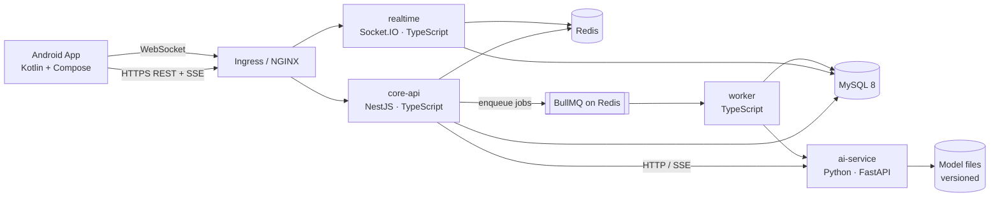
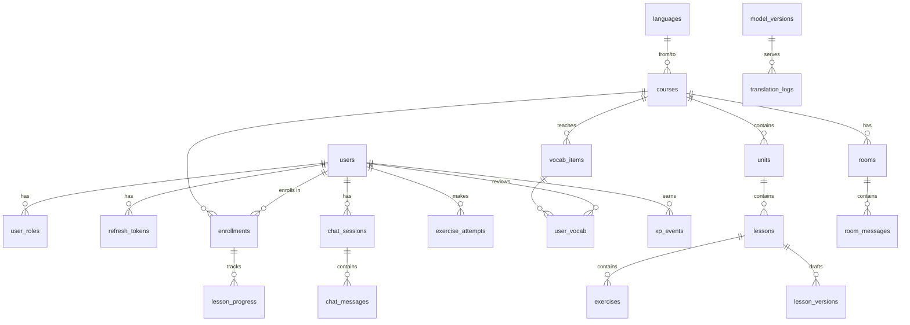

# LangLearn — System Design Document

> Status: **Draft v1** — written before any code, to be reviewed by Shivam.
> Every major decision has a "Why" so it can be challenged in review.

---

## 1. What we are building

LangLearn is a language-learning Android app (think Duolingo + an AI tutor) with its **own translation models**, trained from scratch.

It is **two-way**:

| Learner speaks | Learner learns | Course code |
|---|---|---|
| English | Hindi | `en→hi` |
| Chinese (Mandarin) | English | `zh→en` |
| Japanese | English | `ja→en` |
| Korean | English | `ko→en` |
| Spanish | English | `es→en` |
| Turkish | English | `tr→en` |
| French | English | `fr→en` |
| Dutch | English | `nl→en` |
| German | English | `de→en` |
| Italian | English | `it→en` |
| Polish | English | `pl→en` |
| Swedish | English | `sv→en` |

That is **12 courses** and **2 target languages** (Hindi, English).

A **course** is always a pair: `(from = language the learner already knows, to = language being learned)`.
The UI of the app is shown in the learner's *from* language (localization), and lessons teach the *to* language.

### 1.1 Goals

1. A production-shaped system that matches what a 2–3-year SDE builds and operates.
2. Learn every layer: Android, backend, database, ML (from first principles), DevOps.
3. Every AI feature is powered by models **we train or fine-tune ourselves** — no calls to OpenAI/Claude/Gemini APIs.

### 1.2 Non-goals (to keep scope sane)

- iOS / web client.
- Payments / subscriptions (explicitly excluded — no fintech).
- Beating Google Translate. Our from-scratch model will be *decent*; the learning is the point.
- Running on paid cloud. Everything must run locally (Docker / local Kubernetes) + free GPUs (Colab / Kaggle) for training.

---

## 2. Features

Grouped by phase. **MVP** = what makes the app usable end-to-end.

### MVP
| Feature | Description |
|---|---|
| Auth | Email + password sign-up/login, JWT access + refresh tokens |
| Onboarding | Pick native language → app suggests the course → pick daily goal |
| Course map | Units → Lessons, unlocked in order |
| Lessons | Exercises: multiple choice, translate sentence, match pairs, fill the blank, listen & type |
| Progress | XP, daily streak, lesson completion, offline play with later sync |
| Vocabulary review | Spaced repetition (SM-2 algorithm) — words you're about to forget come back |

### AI features
| Feature | Powered by |
|---|---|
| Translate tool | Our from-scratch Transformer **and** our fine-tuned model, shown side by side with quality scores |
| Grammar correction | Learner writes a sentence in the target language → corrected version + explanation |
| AI Tutor chat | Role-play conversations (ordering food, job interview…), streamed token by token |
| Smart exercises | Tutor generates extra practice sentences from the learner's weak words |

### Social / platform features
| Feature | Description |
|---|---|
| Leaderboards | Weekly XP leagues per course (Redis sorted sets) |
| Practice rooms | Real-time text chat between learners of the same course (WebSockets) |
| Roles | `LEARNER`, `CREATOR` (writes lessons), `ADMIN` (approves content, manages users) |
| Content review | Creator drafts a lesson → Admin approves → published to learners |
| Notifications | Streak reminders (local, via WorkManager) |

### Stretch (only if time permits)
- Pronunciation practice (speech-to-text with an open Whisper model).
- On-device offline translation (our small model exported to ONNX and run in the app).

---

## 3. High-level architecture



### 3.1 Services

| Service | Language | Responsibility | Why separate? |
|---|---|---|---|
| **core-api** | Node + TS (NestJS) | Auth, users, courses, lessons, progress, SRS, leaderboards, content workflow, AI gateway | The main business logic. A **modular monolith**: one deployable, cleanly separated modules |
| **realtime** | Node + TS (Socket.IO) | Practice rooms, presence, typing indicators | Long-lived WebSocket connections scale differently from short HTTP requests |
| **worker** | Node + TS (BullMQ) | Async jobs: leaderboard resets, streak checks, AI batch jobs, sync processing | Slow work must not block API requests |
| **ai-service** | Python (FastAPI + PyTorch) | Model inference: translate, correct grammar, tutor chat | ML lives in Python; it needs different hardware (CPU/GPU, RAM) and scaling |

**Why not full microservices (auth-service, lesson-service, etc.)?**
With one developer, splitting every domain into its own service adds network calls, distributed transactions and deployment overhead without any benefit.
We split **only where there's a real technical reason**: a different runtime (Python), a different connection model (WebSockets) or a different workload (background jobs).
Inside core-api, modules talk through clear interfaces, so any of them *could* be extracted later.
Being able to explain this trade-off in an interview is worth more than having 8 services.

### 3.2 Shared infrastructure

| Component | Used for |
|---|---|
| **MySQL 8** | Source of truth for all persistent data |
| **Redis 7** | Cache, rate limiting, leaderboards (sorted sets), BullMQ queues, Socket.IO adapter (lets several realtime pods share rooms), refresh-token deny list |
| **Object storage (MinIO, S3-compatible)** | Lesson audio, avatars, model files |

---

## 4. Tech stack and why

### 4.1 Android
| Choice | Why |
|---|---|
| Kotlin + **Jetpack Compose** | The current standard for Android UI; XML layouts are legacy |
| **MVVM + Unidirectional Data Flow** (ViewModel exposes `StateFlow<UiState>`) | Predictable state, easy to test |
| **Clean Architecture layers** (data / domain / ui) | Separates business rules from Android framework code |
| **Multi-module Gradle** (`:core:*`, `:feature:*`) | Faster builds, enforced boundaries; it's what larger teams use |
| **Hilt** | Dependency injection, the official recommendation |
| **Room** | Local DB: **offline-first**, so lessons work without internet |
| **Retrofit + OkHttp + kotlinx.serialization** | HTTP client, interceptors for auth tokens |
| **WorkManager** | Background sync of progress + streak reminders |
| **DataStore** | Settings + encrypted token storage |
| **Navigation Compose**, **Coil**, **Media3** | Navigation, images, audio playback |
| **Testing**: JUnit5, MockK, Turbine, Compose UI tests | Unit and UI tests |
| Min SDK 26 (Android 8) | Covers ~97% of devices; keeps modern APIs available |

### 4.2 Backend
| Choice | Why |
|---|---|
| **Node 24 LTS + TypeScript (strict)** | LTS = supported in production. Strict TS catches bugs at compile time |
| **NestJS** | Opinionated structure (modules, DI, guards, interceptors), close to Spring Boot; teaches enterprise patterns better than bare Express |
| **Prisma ORM** | Type-safe queries, migrations as code. We'll also write **raw SQL** for leaderboard and report queries to learn SQL properly |
| **Zod** | Runtime validation of request bodies + env config; shares types with TS |
| **BullMQ** | Reliable Redis-based job queue (retries, delays, cron jobs) |
| **Socket.IO** + Redis adapter | WebSockets with rooms, reconnection and horizontal scaling |
| **Pino** | Fast structured JSON logging |
| **Jest + Supertest + Testcontainers** | Unit tests + integration tests against a real MySQL in Docker |
| **pnpm workspaces** | One repo, several backend apps sharing a `shared` package (types, constants) |
| **OpenAPI (Swagger)** | API contract generated from code, which the Android team (you) consumes |

### 4.3 AI / ML
| Choice | Why |
|---|---|
| **Python 3.12 + PyTorch** | The industry standard for ML research and training |
| **Own BPE tokenizer** (written by hand first), then **SentencePiece** | Writing BPE yourself shows how LLMs "see" text. SentencePiece handles Chinese/Japanese/Korean (no spaces) properly |
| **Transformer encoder-decoder from scratch** | The original *Attention Is All You Need* architecture, built for translation |
| **NLLB-200 (distilled 600M)** fine-tuned with **LoRA** | Meta's open translation model; supports all 13 of our languages. It's the "production quality" baseline to compare our model with |
| **Small open instruct LLM (~1–3B params, e.g. Qwen family)** fine-tuned with LoRA | AI tutor + grammar-correction explanations |
| **FastAPI** | Async Python API; streams responses with Server-Sent Events |
| **ONNX Runtime / llama.cpp (quantized GGUF)** | Fast CPU inference, so it runs without a GPU at serve time |
| **sacreBLEU (BLEU + chrF)**, **FLORES-200** test set | Standard, comparable translation-quality metrics |
| **MLflow** (or Weights & Biases free tier) | Track experiments: hyperparameters, loss curves, metric per model version |

### 4.4 DevOps
| Choice | Why |
|---|---|
| **Docker** (multi-stage builds) | Small, reproducible images |
| **Docker Compose** | One command to run the whole stack locally |
| **GitHub Actions** | CI: lint → test → build → scan → push images to **GHCR** (free registry) |
| **Kubernetes (kind / minikube locally)** | Deployments, Services, Ingress, ConfigMaps, Secrets, probes, HPA autoscaling |
| **Helm** | Templated, versioned k8s manifests (one chart per service + an umbrella chart) |
| **Argo CD** (GitOps) | The cluster pulls its desired state from Git; this is modern "CD" |
| **Prometheus + Grafana + Loki**, **OpenTelemetry** | Metrics, dashboards, logs, distributed tracing |
| **Trivy** | Scan images for vulnerabilities in CI |

---

## 5. AI design (the heart of the project)

### 5.1 The models

| # | Model | Built how | Directions | Used for |
|---|---|---|---|---|
| **M1** | `lingo-hi` | **From scratch.** Our tokenizer + our Transformer | `en→hi` | Learning v1: a single language pair |
| **M2** | `lingo-multi` | **From scratch.** One shared model with a source-language tag (`<ja> 猫が好きです`) | 11 languages `→en` | Learning v2: how one model handles many languages |
| **M3** | `nllb-ft` | **Fine-tuned** NLLB-600M with LoRA on learner-style sentences | all 12 + reverse | Production translation, exercise generation |
| **M4** | `tutor` | **Fine-tuned** small instruct LLM with LoRA | chat in `hi` and `en` | AI tutor role-play, grammar explanations, smart exercises |
| **M5** | `gec` | **Fine-tuned** seq2seq (from M3 or M4) | `en`, `hi` | Grammar error correction |

The app's **Translate** screen shows M1/M2 next to M3 with a quality score. This makes the from-scratch work visible and gives you something concrete to discuss in interviews.

### 5.2 Data (all free)
| Purpose | Dataset |
|---|---|
| English ↔ Hindi | IIT Bombay English-Hindi Corpus (~1.6M pairs), Samanantar subset |
| 11 languages → English | OPUS: Tatoeba (short learner-style sentences, great fit), Europarl (European languages), OpenSubtitles (conversational), CCMatrix subsets |
| Evaluation | FLORES-200 dev/devtest (same sentences in all our languages, so scores are comparable across languages) |
| Grammar correction (en) | W&I+LOCNESS / cLang-8 |
| Grammar correction (hi) | **Synthetic**: we inject realistic errors (gender agreement, postpositions) into clean Hindi |
| Tutor dialogues | Synthetic role-play dialogues generated by an open model, then filtered and reviewed |

### 5.3 Training pipeline

```
raw data → clean (dedupe, length filter, language-ID filter) → split train/val/test
        → train tokenizer → tokenize → train model (Colab/Kaggle GPU)
        → evaluate (BLEU, chrF on FLORES) → log to MLflow
        → export (ONNX / GGUF, quantize) → upload to model store (MinIO) with version tag
        → ai-service loads model by version from config
```

### 5.4 Serving
- `ai-service` exposes `/translate`, `/correct`, `/chat` (SSE streaming).
- core-api is the **only** caller (the Android app never talks to ai-service directly), so auth, rate limits and logging live in one place.
- **Model registry:** a `model_versions` table plus files in MinIO. Switching models is a config change, not a code change.
- **Hardware reality:** training happens on free cloud GPUs. Serving runs on CPU with quantized models (slower, but free). Expect the tutor to reply at a few tokens per second on CPU. That's acceptable, and it's why we stream.

### 5.5 Safety
- Tutor output passes a simple moderation filter (blocklist + a small classifier).
- The user's chat history is only used for training if they opt in.

---

## 6. Data model (MySQL)

Conventions: `snake_case`; every table has `created_at`, `updated_at`.
Primary keys are **UUIDv7 stored as `BINARY(16)`**. UUIDv7 is time-ordered, so it doesn't fragment the InnoDB index the way random UUIDv4 does, and IDs can be generated on the client (needed for offline-first sync).



### 6.1 Tables (key columns)

**Identity**
- `users` — id, email (unique), password_hash (argon2id), display_name, native_language_code, timezone, daily_goal_xp, status (`ACTIVE`/`BANNED`)
- `roles` — id, name (`LEARNER`/`CREATOR`/`ADMIN`)
- `user_roles` — user_id, role_id (composite PK)
- `refresh_tokens` — id, user_id, token_hash, family_id, expires_at, revoked_at, device_info

**Content**
- `languages` — code (PK, e.g. `hi`, `ja`), name, native_name, script, rtl
- `courses` — id, from_lang, to_lang, title, status; **unique(from_lang, to_lang)**
- `units` — id, course_id, position, title, description
- `lessons` — id, unit_id, position, title, status (`DRAFT`/`IN_REVIEW`/`PUBLISHED`), current_version
- `lesson_versions` — lesson_id, version, author_id, content_json, review_status, reviewer_id, review_comment
- `exercises` — id, lesson_id, position, type (`MCQ`/`TRANSLATE`/`MATCH`/`FILL_BLANK`/`LISTEN`), payload (JSON), answer (JSON)
- `vocab_items` — id, course_id, word, translation, part_of_speech, audio_url, example_sentence

**Progress**
- `enrollments` — id, user_id, course_id, xp_total, current_unit_id; unique(user_id, course_id)
- `lesson_progress` — enrollment_id, lesson_id, status, best_score, completed_at
- `exercise_attempts` — id (client-generated), user_id, exercise_id, answer_given, is_correct, time_ms, attempted_at, **idempotency via PK** (offline sync can safely retry)
- `user_vocab` — user_id, vocab_item_id, **SM-2 fields**: ease_factor, interval_days, repetitions, due_at; index on (user_id, due_at)
- `xp_events` — id, user_id, course_id, amount, source, created_at (an **append-only ledger**; totals are derived from it)
- `streaks` — user_id, current_length, longest_length, last_active_date (in the user's timezone)
- `league_results` — week, course_id, user_id, xp, rank (weekly snapshot from Redis)

**AI**
- `chat_sessions` — id, user_id, course_id, scenario, model_version_id
- `chat_messages` — id, session_id, role (`user`/`assistant`), content, token_count
- `model_versions` — id, name (`lingo-hi`), version, kind, artifact_uri, metrics_json, is_active
- `translation_logs` — id, user_id, model_version_id, source_text, output_text, latency_ms, user_feedback

**Realtime**
- `rooms` — id, course_id, name, max_members
- `room_messages` — id, room_id, user_id, content, created_at; index (room_id, created_at)

### 6.2 Notable decisions
- **XP as a ledger** (`xp_events`) rather than one mutable counter: gives an audit trail, lets us rebuild totals and avoids lost updates. `enrollments.xp_total` is a cached sum that's updated in the same transaction.
- **Exercise payloads as JSON**: each exercise type has a different shape. We validate the shape with Zod on write instead of creating one table per type.
- **Leaderboards live in Redis**, not MySQL: `ZINCRBY` / `ZREVRANGE` are O(log n). MySQL only stores the weekly snapshot.

---

## 7. API design

REST, JSON, prefix `/api/v1`. Errors use **RFC 9457 Problem Details** (`application/problem+json`). Lists use **cursor pagination** (`?cursor=…&limit=20`).

### 7.1 Auth
| Method | Path | Notes |
|---|---|---|
| POST | `/auth/register` | email, password, displayName, nativeLanguage |
| POST | `/auth/login` | returns `accessToken` (15 min) + `refreshToken` (30 days) |
| POST | `/auth/refresh` | **refresh-token rotation**: reusing an old token revokes the whole token family (theft detection) |
| POST | `/auth/logout` | revokes the refresh token |

### 7.2 Learning
| Method | Path |
|---|---|
| GET | `/languages` |
| GET | `/courses?from=ja` |
| POST | `/enrollments` — `{ courseId }` |
| GET | `/courses/{id}/tree` — units + lessons + the user's lock/complete state |
| GET | `/lessons/{id}` — exercises (answers are **not** sent for server-graded types) |
| POST | `/sync` — batch upload of offline attempts/progress, idempotent; returns the server state |
| GET | `/review/due?limit=20` — SRS words due today |
| POST | `/review/{vocabId}` — `{ quality: 0-5 }` → next due date |
| GET | `/me/stats` — XP, streak, daily goal progress |
| GET | `/leaderboards/{courseId}/weekly` |

### 7.3 AI
| Method | Path |
|---|---|
| POST | `/ai/translate` — `{ text, from, to, models: ["lingo-hi","nllb-ft"] }` |
| POST | `/ai/correct` — `{ text, lang }` → corrected text + explanation |
| POST | `/ai/chat/sessions` — `{ courseId, scenario }` |
| POST | `/ai/chat/sessions/{id}/messages` — response is **SSE** (`text/event-stream`), streamed tokens |

### 7.4 Content management (roles)
| Method | Path | Role |
|---|---|---|
| POST | `/admin/lessons/{id}/versions` | CREATOR |
| POST | `/admin/lessons/{id}/versions/{v}/submit` | CREATOR |
| POST | `/admin/lessons/{id}/versions/{v}/review` | ADMIN — approve/reject |
| PATCH | `/admin/users/{id}/roles` | ADMIN |

### 7.5 Realtime (Socket.IO, namespace `/rooms`)
Auth: access token in the handshake. Events: `room:join`, `room:leave`, `message:send`, `message:new`, `typing`, `presence:update`.

### 7.6 Cross-cutting
- **Rate limiting** (Redis): stricter on `/auth/*` and `/ai/*`.
- **Idempotency-Key** header on POSTs that create things.
- **Request ID** propagated from the API through the worker and ai-service (traceable logs).
- Health endpoints: `/health/live`, `/health/ready` (used by Kubernetes probes).

---

## 8. Android app design

### 8.1 Module structure
```
android/
├── app/                      # Application, MainActivity, nav graph, DI root
├── core/
│   ├── designsystem/         # Theme, colors, typography, reusable components
│   ├── model/                # Pure Kotlin domain models
│   ├── network/              # Retrofit, auth interceptor, token refresh authenticator
│   ├── database/             # Room DB, DAOs, entities
│   ├── data/                 # Repositories (offline-first: Room is the source of truth for UI)
│   ├── datastore/            # Preferences + tokens
│   └── testing/              # Fakes and test utilities
└── feature/
    ├── auth/  onboarding/  home/  lesson/  review/
    ├── tutor/ translate/  rooms/  profile/  leaderboard/
```

### 8.2 Offline-first data flow
```
UI (Compose) ← StateFlow ← ViewModel ← Repository ← Room (source of truth)
                                           ↑
                     SyncWorker (WorkManager) ↔ core-api /sync
```
- Lessons for the next unit are **pre-downloaded**.
- Attempts are written to Room immediately with a client-generated UUIDv7, then synced in batches. Because the server treats the ID as idempotent, retries are safe.
- **Conflict rule:** the server wins for XP/streaks (computed server-side); the client wins for local-only settings.

### 8.3 Localization
- App strings are translated into all 12 *from* languages (`values-ja/`, `values-hi/`…).
- Fonts that cover the Devanagari, Hangul and CJK scripts.

---

## 9. Repository layout (monorepo)

```
LangLearn/
├── android/                  # Kotlin app (Gradle)
├── backend/                  # pnpm workspace
│   ├── apps/
│   │   ├── core-api/         # NestJS
│   │   ├── realtime/         # Socket.IO server
│   │   └── worker/           # BullMQ workers
│   ├── packages/
│   │   └── shared/           # Shared TS types, Zod schemas, constants
│   └── prisma/               # Schema + migrations
├── ai/
│   ├── training/             # Tokenizer, Transformer, training scripts, notebooks
│   ├── serving/              # FastAPI ai-service
│   └── data/                 # Data download/clean scripts (data itself is git-ignored)
├── infra/
│   ├── docker/               # docker-compose.yml, local config
│   ├── helm/                 # Helm charts
│   └── k8s/                  # kind cluster config, Argo CD apps
├── .github/workflows/        # CI/CD pipelines
└── docs/                     # This design doc, ADRs, learning notes
```

**Why a monorepo?** One place to review, atomic changes that touch the API and the app together, and one CI setup. Path filters in GitHub Actions ensure only the affected parts get built.

---

## 10. DevOps

### 10.1 CI (GitHub Actions)
| Workflow | Trigger | Steps |
|---|---|---|
| `backend-ci` | changes in `backend/**` | install → lint → typecheck → unit tests → integration tests (Testcontainers MySQL) → build images → Trivy scan → push to GHCR (main only) |
| `android-ci` | `android/**` | ktlint/detekt → unit tests → build debug APK → upload artifact |
| `ai-ci` | `ai/**` | ruff + mypy → pytest (tiny model smoke test) → build ai-service image |
| `deploy` | after images are pushed to main | bump image tags in `infra/helm` values → Argo CD syncs the cluster |

### 10.2 Environments
| Env | Where |
|---|---|
| `local` | Docker Compose on your laptop |
| `dev` | Local kind/minikube cluster managed by Argo CD |

### 10.3 Kubernetes objects per service
Deployment (with liveness/readiness probes, resource requests/limits) · Service · HPA (core-api and realtime) · ConfigMap · Secret · Ingress (NGINX; sticky sessions for Socket.IO) · StatefulSets for MySQL/Redis in dev (a managed DB would be used in real prod).

### 10.4 Observability
- Metrics: `/metrics` on every service → Prometheus → Grafana dashboards (request rate, p95 latency, error rate, queue depth, model latency).
- Logs: Pino JSON → Loki.
- Traces: OpenTelemetry across core-api → worker → ai-service.

---

## 11. Security checklist
- Passwords hashed with argon2id; never logged.
- Short-lived access JWT + rotated refresh tokens; tokens stored encrypted on the device.
- Role-based guards on every admin route; ownership checks (a user can only read their own chats).
- Input validation on every endpoint (Zod); Prisma parameterizes all queries (raw SQL uses bound params only).
- Rate limits; helmet security headers; CORS locked down.
- Secrets only via env/K8s Secrets, never committed; `.env.example` documents them.
- Dependency + image scanning in CI.

---

## 12. Phase plan

Each phase ends with: **working code → report → your learning list → your review → changes.**

| Phase | Deliverable | Main things you'll learn |
|---|---|---|
| **0. Foundation** | Monorepo, tooling, Docker Compose (MySQL, Redis, MinIO), CI skeleton | Git workflow, Docker, Compose, CI basics |
| **1. Backend core** | NestJS core-api: config, logging, errors, auth (JWT + rotation), users, roles, languages/courses; Prisma schema + migrations; tests | NestJS, TS, REST, JWT, SQL modelling, testing |
| **2. Android foundation** | Multi-module app, design system, auth + onboarding screens, networking, token refresh, DataStore | Compose, MVVM, Hilt, Retrofit, modularization |
| **3. Learning engine** | Lessons, exercises, offline-first sync, XP ledger, streaks, SM-2 review, leaderboards, seed content for all 12 courses | Offline-first, idempotency, Redis, algorithms, transactions |
| **4. AI part 1** | Data pipeline, hand-written BPE tokenizer, Transformer from scratch, M1 `en→hi` trained + evaluated | Tokenization, attention, training loops, BLEU |
| **5. AI part 2** | M2 multilingual `→en`, M3 NLLB LoRA fine-tune, ai-service (FastAPI, ONNX), Translate screen | Multilingual models, LoRA, model serving, MLOps |
| **6. AI tutor** | M4 tutor + M5 grammar correction, SSE streaming end-to-end, chat UI | LLM fine-tuning, quantization, streaming |
| **7. Social + roles** | realtime service, practice rooms, creator/admin content workflow | WebSockets, scaling sockets, RBAC, workflows |
| **8. Kubernetes + CD** | Helm charts, kind cluster, Argo CD, HPA, Prometheus/Grafana/Loki, OpenTelemetry | K8s, Helm, GitOps, observability |
| **9. Hardening** | Load tests (k6), security review, performance tuning (`EXPLAIN`), docs, README demo | Production readiness |

---

## 13. Prerequisites on your machine

| Tool | Status | Needed from |
|---|---|---|
| Git | ✅ 2.43 | now |
| Node.js | ⚠️ v23 installed: **not an LTS release and out of support**. Install **Node 24 LTS** | Phase 0 |
| pnpm | via `corepack enable` | Phase 0 |
| Docker Desktop (WSL2 backend) | ❌ not found | Phase 0 |
| Python | ⚠️ 3.13 installed. Use **3.12** via `uv` for the best ML library compatibility | Phase 4 |
| Android Studio + JDK 21 | ? | Phase 2 |
| kind or minikube, kubectl, Helm | later | Phase 8 |
| Google Colab / Kaggle account | free GPU | Phase 4 |

---

## 14. Open questions for review
1. Is a **modular monolith** plus 3 specialized services the right split, or do you want more services purely for practice (at the cost of complexity)?
2. **Prisma vs TypeORM vs raw SQL (Knex):** Prisma is proposed; OK?
3. Lesson **content source:** I'll seed a small starter curriculum (~2 units per course); creators/admins add more. OK?
4. **App name:** "LangLearn" (from the repo) for now?
